# ERD Lógico — Sistema Lojasaph

Data: 2026-08-17
Status: Fase 2

Este ERD é conceitual/lógico. Ele não representa ainda um schema SQL definitivo.

```mermaid
erDiagram
    ORGANIZATION ||--o{ BUSINESS : owns
    ORGANIZATION ||--o{ SUPPLIER : has
    ORGANIZATION ||--o{ STOCK_ITEM : catalogs
    ORGANIZATION ||--o{ EMPLOYEE : employs
    ORGANIZATION ||--o{ USER_MEMBERSHIP : grants

    BUSINESS ||--o{ UNIT : has
    BUSINESS ||--o{ SALES_ITEM : sells

    UNIT ||--o{ SECTOR : contains
    UNIT ||--o{ STOCK_LOCATION : contains
    UNIT ||--o{ CASH_REGISTER : contains
    UNIT ||--o{ PAYABLE_DOCUMENT : scopes

    SECTOR o|--o{ STOCK_LOCATION : may_scope

    STOCK_ITEM ||--o{ ITEM_ALIAS : has
    STOCK_ITEM ||--o{ SUPPLIER_ITEM : sourced_by
    STOCK_ITEM ||--o{ STOCK_MOVEMENT_ITEM : moved_as
    STOCK_ITEM ||--o{ INVENTORY_BATCH : stocked_as
    STOCK_ITEM ||--o{ INVENTORY_COUNT_LINE : counted_as

    SUPPLIER ||--o{ SUPPLIER_CONTACT : has
    SUPPLIER ||--o{ SUPPLIER_TERMS : has
    SUPPLIER ||--o{ SUPPLIER_ITEM : offers
    SUPPLIER ||--o{ PURCHASE_ORDER : receives
    SUPPLIER ||--o{ PAYABLE_DOCUMENT : bills

    SUPPLIER_ITEM ||--o{ SUPPLIER_PRICE : priced_at

    PURCHASE_ORDER ||--o{ PURCHASE_ORDER_ITEM : contains
    PURCHASE_ORDER ||--o{ GOODS_RECEIPT : fulfilled_by
    GOODS_RECEIPT ||--o{ GOODS_RECEIPT_ITEM : contains
    GOODS_RECEIPT_ITEM o|--o{ INVENTORY_BATCH : creates

    STOCK_LOCATION ||--o{ INVENTORY_BATCH : stores
    STOCK_LOCATION ||--o{ INVENTORY_COUNT : counted_at
    STOCK_LOCATION ||--o{ TRANSFER : source_or_destination
    STOCK_LOCATION ||--o{ LOAN : source_or_destination

    STOCK_MOVEMENT ||--|{ STOCK_MOVEMENT_ITEM : contains
    STOCK_MOVEMENT o|--o| STOCK_MOVEMENT : reverses

    TRANSFER ||--|{ TRANSFER_ITEM : contains
    LOAN ||--|{ LOAN_ITEM : contains

    INVENTORY_COUNT ||--|{ INVENTORY_COUNT_LINE : contains

    PAYABLE_DOCUMENT ||--|{ INSTALLMENT : splits_into
    INSTALLMENT ||--o{ PAYMENT : receives
    INSTALLMENT ||--o{ PAYMENT_INSTRUCTION : can_have

    CASH_REGISTER ||--o{ CASH_SESSION : opens
    CASH_SESSION ||--o{ CASH_MOVEMENT : contains
    CASH_SESSION ||--o{ PAYMENT_METHOD_TOTAL : summarizes

    PAYMENT_METHOD ||--o{ PAYMENT : used_by
    PAYMENT_METHOD ||--o{ PAYMENT_METHOD_TOTAL : summarized_by
    PAYMENT_METHOD ||--o{ FEE_RULE : priced_by

    USER ||--o{ USER_MEMBERSHIP : has
    ROLE ||--o{ USER_MEMBERSHIP : grants
    ROLE ||--o{ ROLE_PERMISSION : has
    PERMISSION ||--o{ ROLE_PERMISSION : included_in

    ORGANIZATION ||--o{ IMPORT_BATCH : imports
    IMPORT_BATCH ||--o{ IMPORT_ROW_RESULT : produces
    ORGANIZATION ||--o{ AUDIT_LOG : audits
```

## Relações-chave

### Organization → Business → Unit

A hierarquia permite um mesmo grupo operar múltiplos negócios/marcas e cada negócio possuir múltiplas unidades.

### Unit → Sector e StockLocation

Setor descreve responsabilidade/área operacional; StockLocation descreve onde o saldo físico é controlado. Eles podem se relacionar, mas não são equivalentes.

### StockItem → InventoryBatch → StockLocation

Um item pode existir em múltiplos locais e lotes. Lote carrega custo/validade quando aplicável.

### StockMovement → StockMovementItem

Toda mudança de saldo confirmada precisa ser explicável por um movimento e seus itens.

### Transfer/Loan → StockMovement

Transfer e Loan são agregados de processo. Seus despachos, recebimentos e retornos geram movimentos de estoque rastreáveis.

### Supplier → SupplierItem → SupplierPrice

O cadastro preserva múltiplos fornecedores por item e histórico de preço ao longo do tempo.

### PayableDocument → Installment → Payment

Documento financeiro, parcela e pagamento são conceitos separados. Uma parcela pode receber múltiplos pagamentos.

### CashSession → PaymentMethodTotal

O MVP trabalha com totais consolidados por forma de pagamento. Isso permite integrar vendas individuais posteriormente sem redesenhar o fechamento.

---

# Agregados transacionais

Para reduzir inconsistência, comandos devem operar por agregados e transações coerentes:

## Transfer

Uma transação de despacho deve:
1. validar origem/destino;
2. validar quantidades e política de estoque negativo;
3. gerar movimento de saída;
4. atualizar projeção de saldo;
5. registrar auditoria.

Recebimento é uma transação separada e gera entrada no destino.

## GoodsReceipt

Ao confirmar:
1. validar itens/custos;
2. gerar lotes quando necessário;
3. gerar movimento de entrada;
4. recalcular custo médio;
5. registrar histórico de preço quando aplicável.

## InventoryCount

Ao confirmar:
1. congelar snapshots esperados do inventário;
2. calcular diferenças;
3. gerar ajustes positivos/negativos;
4. registrar responsável e auditoria.

## Payment

Ao registrar:
1. validar parcela e valor;
2. persistir evento de pagamento;
3. recalcular saldo/status derivado da parcela/documento;
4. registrar auditoria.

## CashSession

Ao fechar:
1. validar sessão aberta;
2. consolidar formas de pagamento e movimentos;
3. calcular esperado;
4. receber valor contado;
5. calcular divergência;
6. fechar sessão e auditar.

---

# Fronteiras de consistência

Não é necessário bloquear toda a Organization numa única transação. As fronteiras principais são:

- um recebimento de mercadoria;
- um movimento/transferência por etapa;
- um inventário confirmado;
- um pagamento;
- uma sessão de caixa fechada.

Relatórios e dashboards podem aceitar consistência eventual curta quando forem projeções reconstruíveis, mas os registros transacionais de origem precisam ser fortemente consistentes.
